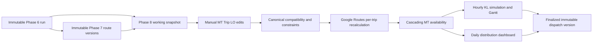

# Architecture

The repository is a monorepo:

- `apps/api`: FastAPI, SQLAlchemy models, import pipeline, compatibility API.
- `apps/web`: React, TypeScript, Tailwind, ECharts dashboard.
- `db/migrations`: Alembic migrations targeting PostgreSQL/PostGIS.
- `services/analytics`: idempotent analytics job entry points.
- `example data`: source workbooks used to validate Phase 0.

Phase 0 uses PostgreSQL/PostGIS as the system of record. All imports create an `import_audit` record and staging rows before canonical tables are updated. Canonical tables keep `source_import_id` so published data can be traced back to the source file and sheet.

The backend API is versioned under `/api/v1`. Later phases should add derived fact tables and endpoints without changing Phase 0 canonical identifiers.

Phase 5 remains inside the FastAPI modular monolith. Synchronous status transitions (`PENDING`, `PREPARING_DATA`, `TRAINING`, `CALCULATING_PROFILES`, `COMPLETED`, `FAILED`) preserve an upgrade path to a background worker without adding a second service prematurely. Engine B joblib packages and JSON manifests are stored under `ML_ARTIFACT_DIR`; Docker Compose mounts the `ml_artifacts` named volume. Database rows retain parameters, snapshots, assignments, profiles, relative artifact URI, SHA-256, audit user, and timestamps.

The repository has no authentication provider. Phase 5 exposes a replacement seam through `phase5_auth`: local calls preserve current permissive behavior, while deployments may pass `X-User` and comma-separated `X-Permissions` (`phase5:view`, `phase5:run`, `phase5:train`, `phase5:save`, `phase5:activate`, `phase5:delete`). This is not a login system; production should replace the dependency with the platform identity provider.

Phase 6 extends the same modular monolith through validation, inference, rolling assignment, route estimation, persistence, export, settings, and authorization modules. Phase 5 artifact integrity is checked before inference when a joblib package exists; normalized model-registry assignments remain the persisted representation for legacy development databases. Phase 4 affinity creates ranking evidence, while `compatibility.evaluate_compatibility_entities` remains the single master-rule evaluator.

Phase 6 prediction execution is outside the FastAPI process. The API transaction persists a `prediction_run` and `prediction_job`, then returns `202`; the dedicated `phase6-worker` service claims queue rows with PostgreSQL `FOR UPDATE SKIP LOCKED`. Each attempt receives a lease/fencing token and runs in an isolated child process. The parent worker updates heartbeat/lease metadata, enforces a hard execution timeout, and recovers an expired lease to `QUEUED` until `max_attempts` is reached. Final prediction rows and the job `COMPLETED` state commit atomically after validating the fencing token, preventing an obsolete worker from committing after recovery. API/container restarts therefore do not lose queued work or leave permanent orphan `RUNNING` rows.

```text
Timestamped LO + Initial MT Availability
    → Phase 2 shift derivation
    → Phase 5 time-feasible shipment prediction
    → Phase 4 MT score + Phase 1 compatibility
    → rolling chronological vehicle state
    → DRIVE-only Google/fallback travel estimate
    → cycle time, estimated return, next availability
    → persisted final trip timeline + Phase 7 input
```

`Phase6RouteEstimationService` estimates one predicted shipment at a time. It may evaluate small permutations or nearest-neighbor stop order solely to estimate cycle time. It never calls Google Route Optimization, GMPRO `optimizeTours`, or a fleet-wide VRP solver. That boundary keeps preliminary `estimated_visit_sequence` distinct from the final optimized route owned by Phase 7.

Google Routes requests are backend-only. The global API key is encrypted using an environment-provided application secret; the database stores ciphertext/fingerprint/mask, the frontend receives only the mask, and prediction snapshots retain configuration version—not key material. Phase 6 Indonesia enforces `DRIVE`; no TRUCK/Large Vehicle request or profile is sent. Route cache identity includes endpoints, departure bucket, routing preference, DRIVE mode, and configuration version. Google failures use visibly marked historical/default route estimates.

Phase 6 run rows retain immutable input/model/routing/parameter/original-result snapshots and a separate final dispatch snapshot. Audited overrides recalculate route/cycle/availability and downstream rolling state without retraining Phase 5 or rewriting the original model layer. `phase6_auth` exposes `phase6:view`, `phase6:run`, `phase6:export`, `phase6:override`, `google_routes:view`, and `google_routes:manage` through the same replaceable header seam.

Phase 7 adds a depot/date-scoped operational control workspace without changing the Phase 6 source run. The selected completed Prediction Run is imported once: Phase 6 shipment, vehicle, pairing, and confidence remain immutable warm-start/soft-preference fields, while Phase 7 current shipment, vehicle, trip, compartment, stop, bay, and gate-out fields live in separate state/version tables.

Phase 7 optimization endpoints use a short synchronous preflight followed by asynchronous execution. A successful Initial/Re-Optimize submission atomically sets `optimization_job.status=CALCULATING` and returns `202 Accepted`; FastAPI then runs matrix/solver/persistence as a background task with a fresh database session. The web app immediately returns to Job Management and polls calculating rows. Duplicate submissions and deletion are rejected while the reservation is active. Because this background executor is process-local rather than a durable external queue, API startup recovery converts orphaned `RUNNING`/`CALCULATING` work to auditable `FAILED/INTERRUPTED` state for an explicit retry.

```text
Immutable Phase 6 run + current LO/MT/bay state + parameter snapshot
    → prebuilt Google Routes/master-fallback distance-time matrix
    → OR-Tools Routing Solver physical-MT trip rounds
    → CP-SAT one-product compartment placement
    → FIFO_BALANCED bay eligibility, actual queue, loading, and gate-out
    → per-trip candidate-audited post-bay repair and return propagation
    → optional bay CP-SAT experiment when explicitly selected
    → append immutable Route V1/V2/... + cost/audit/dropped reasons
```

Google Routes is a travel-data provider only. Matrix calls are completed before solver evaluation, callbacks use in-memory integers, and Compute Routes geometry is requested only for solver-selected final legs. Neither Phase 6 nor Phase 7 calls GMPRO/`optimizeTours`. Offline/master Haversine fallback remains explicit in provider metadata and map styling.

The multi-trip state is keyed by physical MT, not by duplicated virtual vehicles. Each accepted trip updates predicted depot return, used/remaining working time, and completed trip count before the same MT may enter another routing round. During reroute, DONE, ONGOING, freeze-window PLANNED, and every LO sharing one of those physical trips are copied unchanged into the next version. Actual user ETA and bay/queue state outrank prior system predictions.

Phase 8 adds a separate mutable manual-dispatch snapshot after Phase 6/7. It never invokes OR-Tools, GMPRO, or any fleet-wide solver. The selected source route is copied once into Phase 8 job/vehicle/LO/trip/assignment tables; cluster, shift, tags, route metadata, and source lineage remain snapshot evidence. The canonical compatibility evaluator remains authoritative for manual assignments.



All Phase 8 mutations are transactional and job/trip versions provide optimistic conflict detection. A database uniqueness constraint prevents duplicate LO assignment. Route failures remain explicit `WARNING`/`CONFLICT`; downstream trip timestamps become `NEEDS_RECALCULATION` instead of silently retaining stale values. Simulation and dashboard are server-side projections of the same current relational state used by Trip Management.

The Phase 7 → Phase 8 handoff is copy-on-create, not a live foreign-state projection. A Manual Dispatch Job records the source Phase, Phase 7 Job, Prediction Run where available, Route Version label/identifier, source creation time, and a configuration/lineage snapshot. Later reroutes in Phase 7 do not mutate an existing Phase 8 workspace. Likewise, Phase 8 Apply and Finalize never move the Phase 7 current-route pointer.

Phase 8 maintains one relational current state shared by all workspace tabs. Trip mutations and Apply refresh the same vehicle/trip/LO graph consumed by the simulation and dashboard projections; the frontend does not maintain separate authoritative copies per tab. Finalization validates the persisted state inside a transaction, stores actor/time, and converts that dispatch version to read-only.
