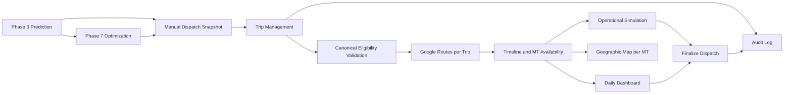

# Phase 8 — Manual Dispatching & Operational Simulation

## Tujuan dan boundary

Phase 8 adalah workspace human-in-the-loop setelah Phase 6 Prediction dan Phase 7 Route Optimization. Dispatcher memilih satu source route, membuat snapshot lengkap, menyesuaikan `MT → Trip → Loading Order`, menjalankan guardrail compatibility dan recalculation per trip, melihat simulasi kapasitas/workload harian, lalu memfinalkan dispatch plan.

- Phase 6 tetap menjadi prediction/warm-start intelligence.
- Phase 7 tetap menjadi global multi-trip VRP dan bay optimization.
- Phase 8 tidak memanggil solver fleet-wide dan tidak melakukan global reoptimization.
- Tabel Phase 6/7 tidak pernah diubah. Source hanya dibaca saat snapshot dibuat.
- Apply hanya menghitung ulang trip yang dipilih dan meng-invalidasi dependency trip berikutnya pada MT yang sama.

## Source snapshot dan lineage

Create Job meminta Depot, Operational Date, Phase 7 Job, Source Route, dan nama job. Source Route diambil dinamis dari database dan dapat berupa Phase 6 Prediction/Warm Start atau Route Version Phase 7 mana pun (`V1`, `V2`, dan versi setelahnya). Tidak ada batas versi yang di-hardcode.

Snapshot menyimpan `source_phase`, `source_job_id`, `source_run_id`, `source_route_id`, `source_route_version`, `source_created_at`, `dispatch_version`, configuration snapshot, serta cluster/shift/tag evidence dari konteks source. LO yang tidak mempunyai assignment tetap disalin ke `manual_dispatch_loading_order` dengan status `UNASSIGNED`.

Phase 8 dibuka melalui `/phase-8/manual-dispatch`. Landing menampilkan paginated Manual Dispatch Job List dengan filter depot, operational date, status, dan pencarian Job ID/nama. Editor baru dibuka setelah dispatcher memilih **Open**. URL workspace `/phase-8/manual-dispatch/:jobId?tab=...` mempertahankan tab aktif untuk bookmark dan browser navigation.

Create Job memakai dependent selection berikut:

1. pilih depot;
2. pilih operational date;
3. pilih Phase 7 Job yang depot dan tanggal operasionalnya cocok;
4. pilih Phase 6 Prediction/Warm Start atau Route Version Phase 7 yang ditemukan dinamis;
5. isi Manual Dispatch Job Name lalu klik **Create & Load**.

Snapshot adalah point-in-time copy. Reroute Phase 7 setelahnya tidak mengubah Phase 8 job yang sudah dibuat, dan perubahan Phase 8 tidak pernah memindahkan `optimization_job.current_route_version_id`.



## Trip Management

Workspace memakai satu current dispatch state untuk seluruh tab. Hierarki UI dan domain adalah `MT → Trip → LO`. MT menyimpan registration, class/capacity KL, tag, compartment snapshot, dan initial/last availability. Trip menyimpan sequence, departure, return, turnaround, availability, distance/duration, route status, optimistic `row_version`, dan route geometry. LO scope menyimpan product, KL, SPBU, saved cluster, saved shift, dan SPBU tag.

Setiap Add/Remove/Move/Reorder/Departure edit mengubah status trip menjadi `MODIFIED`. Hasil route/timeline baru authoritative setelah Apply berhasil. Constraint keras mencakup scope/depot, canonical MT–SPBU compatibility, MT aktif, tag subset, vehicle-class limit, uniqueness LO lintas job, capacity, compartment/product check yang tersedia, sequence, dan MT availability.

Database constraint `uq_manual_dispatch_lo_assignment` mencegah satu LO scope berada pada dua trip sekaligus. Mutation menerima `expected_job_version`; konflik edit mengembalikan HTTP 409 dan tidak silently overwrite state dispatcher lain.

## Geographic Map

Tab **Geographic Map** membatasi render pada satu MT yang dipilih. Search box mencocokkan registration/no MT atau canonical `mt_id`; dropdown **Select No. MT** hanya menampilkan MT yang mempunyai trip. Setelah dipilih, endpoint map membaca urutan stop dari current Phase 8 snapshot dan menampilkan seluruh trip MT tersebut sebagai Depot → SPBU sesuai stop sequence → Depot.

Geometry yang ditampilkan wajib road-following Google Routes. Trip yang sudah mempunyai `route_geometry` dengan source Google memakai geometry tersimpan tanpa request baru. Source snapshot non-Google atau trip tanpa geometry meminta satu full-route Google Routes dengan ordered SPBU sebagai intermediates. Hydration ini read-only: distance, assignment, sequence, ETA, route status, `row_version`, dan geometry persisted tidak diubah hanya karena map dibuka. Bila API key, koordinat, atau Google route gagal, error tampil per trip dan UI tidak menggambar garis lurus sebagai pengganti jalan.

### Job dan trip lifecycle

| Entity | Status | Arti operasional |
|---|---|---|
| Job | `DRAFT` | Snapshot baru, belum menjadi plan siap finalisasi |
| Job | `IN_PROGRESS` | Ada edit, trip stale, warning, atau kalkulasi yang belum lengkap |
| Job | `READY` | Semua trip yang ada sudah `VALID`; final validation tetap wajib dijalankan |
| Job | `FINALIZED` | Dispatch version read-only dengan actor dan timestamp finalisasi |
| Trip | `DRAFT` | Trip baru belum mempunyai hasil Apply |
| Trip | `MODIFIED` | Assignment/order/departure berubah dan hasil route lama tidak authoritative |
| Trip | `CALCULATING` | Apply sedang menghitung route |
| Trip | `VALID` | Hard validation dan route calculation berhasil |
| Trip | `WARNING` | Provider route gagal atau hasil belum aman dianggap valid |
| Trip | `CONFLICT` | Hard constraint, coordinate, capacity, compatibility, atau timeline gagal |
| Trip | `NEEDS_RECALCULATION` | Dependency dari trip sebelumnya berubah |

### Eligible dan Unassigned LO

Drawer **Add LO** hanya membaca kandidat dari backend. LO selectable harus berada pada planning scope/job/depot yang sama, belum assigned di trip lain, MT masih active dan eligible untuk depot, serta lulus canonical `evaluate_mt_spbu_compatibility` untuk vehicle class, required SPBU tags, dan rule product yang tersedia. Capacity/compartment checks juga dijalankan sebelum Apply. Frontend tidak membuat compatibility rule kedua.

Unassigned LO tetap menjadi record planning scope, bukan dihapus. Panel menampilkan count, KL, affected SPBU, search, shift, cluster, product, SPBU, dan reason/status. Add atau Move mengubahnya menjadi `ASSIGNED`; Remove atau Delete Trip mengembalikannya ke `UNASSIGNED` dalam transaksi yang sama.

## Apply, Google Routes, dan service time

Apply menjalankan urutan berikut:

1. validasi hard constraint;
2. bentuk ordered unique SPBU stops dari LO stop sequence;
3. hitung `Depot → SPBU ... → Depot` memakai konfigurasi dan encrypted API key Google Routes existing;
4. simpan setiap leg, coordinates, distance, static/traffic duration, provider, timestamp, dan response status;
5. tambahkan service time per unique SPBU dari configuration snapshot dan optional operational buffer;
6. hitung ETA per SPBU, return depot, dan `available_after = return + turnaround`;
7. simpan trip `VALID`, update timeline MT, lalu invalidasi downstream trip.

Route timeout, quota, authentication, zero route, atau coordinates invalid tidak dianggap sukses. Trip menjadi `WARNING` untuk provider failure atau `CONFLICT` untuk hard input/coordinate failure. Unit test memakai injected route provider sehingga tidak melakukan network call.

## Multi-trip availability dan cascade

Trip pertama memakai initial MT availability. Trip berikutnya hanya dapat dibuat bila trip sebelumnya `VALID` dan mempunyai `available_after_trip_datetime`; start default sama dengan timestamp availability tersebut. Trip tidak dapat dimulai lebih awal.

Perubahan trip awal mengubah `available_before` trip langsung berikutnya dan menandai seluruh downstream trip `NEEDS_RECALCULATION`. Return/availability lama downstream dibersihkan sehingga timestamp stale tidak terlihat valid. Delete Trip mengembalikan semua LO ke `UNASSIGNED`, resequence trip tersisa, dan membuat audit event.

## Simulation Diagram

Backend mengagregasi bucket 15/30/60 menit; default UI 60 menit. Timestamp asli tetap disimpan pada trip/assignment, bukan hanya bucket.

```text
LO Gate-Out Demand(t) = Σ volume_kl LO pada trip yang departure di bucket t
Available MT Capacity(t) = Σ capacity_kl MT yang berada di depot pada titik t
Capacity Gap(t) = Available MT Capacity(t) - LO Gate-Out Demand(t)
```

Gap negatif diberi label Capacity Shortage Indicator, bukan definitive infeasibility. Gantt memakai interval `AVAILABLE_AT_DEPOT` dan `TRIP`; bar trip dapat membuka/fokus trip yang sama pada Trip Management.

Summary card mengambil peak demand KL/bucket, minimum available capacity KL, maximum negative gap, peak gate-out time, shortage bucket count, MT active/idle, dan total trip dari aggregate server yang sama. Filter Gantt tidak mengubah dispatch state; ia hanya membatasi kendaraan yang dirender.

## Daily Distribution Dashboard

Dashboard menampilkan KPI demand/assignment/fleet/trip, hourly gate-out KL, cumulative assigned KL dan demand target, distribusi memakai saved shift/cluster source, fleet utilization, serta remaining demand by shift/cluster/product/SPBU.

`Utilization Time % = active valid trip time / depot operating window`. Metric ini berbeda dari `Volume Capacity Utilization = assigned volume / sum(trip vehicle capacity)` dan keduanya diberi nama berbeda.

## Versioning, audit, dan finalization

Finalized version immutable. `Create New Version` melakukan deep copy state LO/MT/trip/assignment/route-leg menjadi job baru dengan parent lineage dan `Dispatch V(n+1)`. Audit mencatat actor, timestamp, action, entity, previous/new JSON, source/destination, metadata MT/trip/LO, dan reason.

Finalization memblokir duplicate/unmapped LO, incompatibility, capacity/sequence error, trip belum dihitung, `NEEDS_RECALCULATION`, route failure, timestamp invalid, dan overlapping trip. Unassigned LO adalah warning yang membutuhkan acknowledgment kecuali konfigurasi masa depan menetapkannya sebagai hard rule. Setelah sukses status menjadi `FINALIZED`, `finalized_by/finalized_at` disimpan, dan mutation langsung ditolak.

`Create New Version` dapat dipakai dari existing atau finalized dispatch. Operasi ini menyalin MT, LO scope, trip, assignment, dan route leg ke job baru, menaikkan `dispatch_version`, menyimpan `parent_dispatch_job_id`, serta membuka state baru sebagai draft. Finalized parent tidak pernah diubah.

## Schema dan API

Migration `0022_phase8_manual_dispatch` menambah:

- `manual_dispatch_job`
- `manual_dispatch_vehicle`
- `manual_dispatch_loading_order`
- `manual_dispatch_trip`
- `manual_dispatch_trip_lo`
- `manual_dispatch_route_leg`
- `manual_dispatch_audit_log`

API prefix: `/api/v1/phase8/manual-dispatch`. Endpoint mencakup source options, paginated job list/create/detail, version create, eligibility, trip CRUD, LO add/remove/move/reorder, Apply, simulation, dashboard, selected-MT Geographic Map, audit, validation, dan finalize. Identity seam memakai permission `phase8:view`, `phase8:edit`, dan `phase8:finalize` melalui header pattern yang sama dengan modul terdahulu.

| Method | Endpoint | Tujuan |
|---|---|---|
| `GET` | `/sources` | Depot, Phase 7 Job, dan source route dinamis |
| `GET`, `POST` | `/jobs` | Paginated list dan Create & Load snapshot |
| `GET` | `/jobs/{job_id}` | Shared current workspace state |
| `POST` | `/jobs/{job_id}/versions` | Deep-copy child dispatch version |
| `GET` | `/jobs/{job_id}/vehicles/{vehicle_id}/eligible-loading-orders` | Canonical eligible/ineligible LO evidence |
| `POST` | `/jobs/{job_id}/trips` | Add next trip setelah predecessor valid |
| `PATCH`, `DELETE` | `/jobs/{job_id}/trips/{trip_id}` | Edit departure atau delete/resequence trip |
| `POST`, `DELETE` | `/jobs/{job_id}/trips/{trip_id}/loading-orders[...]` | Add/remove LO assignment |
| `POST` | `/jobs/{job_id}/loading-orders/{lo_scope_id}/move` | Atomic move antartip/MT |
| `PUT` | `/jobs/{job_id}/trips/{trip_id}/stop-order` | Persist LO/SPBU stop order |
| `POST` | `/jobs/{job_id}/trips/{trip_id}/apply` | Validate, route, timeline, cascade, refresh |
| `GET` | `/jobs/{job_id}/simulation` | Bucketed demand/capacity/gap dan Gantt |
| `GET` | `/jobs/{job_id}/dashboard` | Daily distribution/fleet aggregates |
| `GET` | `/jobs/{job_id}/map?vehicle_id=...` | Read-only Google road geometry untuk satu MT terpilih |
| `GET` | `/jobs/{job_id}/audit` | Human-readable append-only history |
| `GET` | `/jobs/{job_id}/validation` | Complete pre-finalization validation |
| `POST` | `/jobs/{job_id}/finalize` | Atomic validation, warning acknowledgment, lock |

Route fragments di atas relatif terhadap API prefix. Gunakan FastAPI OpenAPI sebagai source request/response schema yang authoritative.

## Atomicity dan refresh contract

Add/Remove/Move LO, Delete Trip, Apply, Create Version, dan Finalize berjalan dalam database transaction. Job/trip `row_version` menyediakan optimistic locking dan duplicate LO juga dilindungi unique constraint. Conflict dikembalikan sebagai HTTP 409 dengan pesan yang dapat ditampilkan dispatcher.

Setelah mutation sukses, frontend memakai state-management pattern existing dan me-refresh workspace yang terkena perubahan—termasuk vehicle/trip, Unassigned LO, Simulation, dan Dashboard—tanpa full-page reload. Semua tab tetap menjadi projection dari satu persisted current dispatch state.

## Verification

Automated test tidak memanggil external Google Routes. Injected/mock provider dipakai untuk acceptance utama:

- immutable Phase 7 V2 snapshot dan source lineage;
- canonical tag eligibility;
- first/next-trip availability serta downstream cascade;
- duplicate LO rejection dan Delete Trip mengembalikan LO ke Unassigned;
- simulation `120 KL - 96 KL = -24 KL`;
- finalization blocker, unassigned acknowledgment, finalized read-only, dan version deep copy.

Focused Phase 8 suite lulus **7 tests**, full API deployment-image suite lulus **159 tests**, frontend production build lulus, PostgreSQL berada pada single migration head `0022_phase8_manual_dispatch`, dan browser smoke test memverifikasi landing, dependent source selector, dynamic `V1`/`V2`, serta create-job dialog tanpa console error. Test map menginjeksi full-route Google-compatible provider dan memastikan hydration selected-MT tidak menulis geometry kembali ke snapshot.

## Operational limitations

- Phase 8 tidak mengoptimalkan ulang fleet secara global.
- Product compatibility khusus hanya dapat dienforce bila master rule/table-nya tersedia; canonical evaluator saat ini mengembalikan warning bila explicit product rule belum ada.
- Service time memakai configuration snapshot global karena master SPBU-specific service duration belum tersedia.
- Apply per trip melakukan one leg request per ordered route edge agar setiap route leg dapat diaudit secara relasional.
- Geographic Map memakai geometry Google tersimpan atau satu full-route request per trip terpilih; kegagalan Google tidak diganti straight-line fallback.
- Optional bulk **Recalculate Remaining Trips** dan route-leg cache khusus Phase 8 belum diaktifkan; dispatcher Apply ulang downstream trip secara berurutan.
