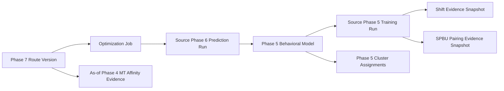

# Phase 9 — Route–Model Alignment Evaluation

## 1. Tujuan

Phase 9 menjelaskan seberapa selaras satu hasil Route Version Phase 7 terhadap pola historis yang menjadi lineage analitisnya. Phase 9 bersifat deskriptif dan auditable.

Phase 9 **tidak**:

- menyatakan route baik, buruk, optimal, atau tidak optimal;
- memberikan rekomendasi perubahan route, shipment, shift, atau MT;
- menjalankan ulang Phase 2–7;
- melatih ulang model Phase 5;
- mengubah Route Version atau source record apa pun;
- membuat satu overall score yang mencampurkan seluruh kategori.

Empat skor ditampilkan terpisah:

1. **Cluster Cohesion**
2. **Shift Alignment**
3. **Historical SPBU Pairing**
4. **Historical MT Affinity**

Semua skor menggunakan skala `0–100%`, tetapi tidak mempunyai klasifikasi normatif seperti Good, Bad, Pass, Fail, Recommended, atau Rejected. Nilai yang tidak dapat dihitung ditampilkan sebagai `N/A` bersama alasan dan evidence coverage.

## 2. User flow

Halaman Phase 9 dibuka melalui `/phase9/route-model-alignment`.

```text
Pilih TBBM
  → sistem memuat Route Version Phase 7 yang tersedia
  → pilih satu Route Version
  → klik Evaluate Alignment
  → sistem membentuk Source-Aligned Bundle secara otomatis
  → sistem menghitung dan menyimpan Evaluation Run
  → dashboard, tabel LO, dan evidence drawer ditampilkan
```

Hanya ada dua input bisnis:

- **TBBM**
- **Route Version Phase 7**

Tidak ada selector saved analysis atau model pada alur utama. Model dan bukti historis ditentukan dari lineage route.

Sebelum tombol **Evaluate Alignment** ditekan, dashboard dan tabel hasil tetap kosong. Mengganti TBBM mengosongkan route dan hasil. Mengganti route mengosongkan hasil lama sampai evaluation run yang sesuai dibuka atau dijalankan.

## 3. Route option contract

Route selector hanya menampilkan persisted `RouteVersion` Phase 7 yang berada pada TBBM terpilih. Route tidak dibatasi pada current version; `V1`, `V2`, dan seluruh immutable route version lain tetap dapat dievaluasi.

Label route:

```text
{operating_date} · {job_no} · {version_label} · {reason}
```

Metadata option:

- `route_version_id`
- `version_label`
- `job_id` dan `job_no`
- `operating_date`
- `created_at`
- `solver_status`
- current-version indicator
- source Prediction Run ID/no
- source Phase 5 model ID/name/version
- jumlah trip, routed LO, dan dropped LO
- lineage readiness

Route tanpa source prediction/model lineage tetap terlihat tetapi disabled dengan alasan `MODEL_LINEAGE_MISSING`. Route yang berasal dari TBBM lain tidak boleh dievaluasi melalui request yang dimanipulasi.

## 4. Source-Aligned Bundle

### 4.1 Lineage utama

Bundle dibentuk dengan jalur berikut:



Resolver wajib memverifikasi bahwa route, job, prediction run, dan model berada pada depot yang sama.

### 4.2 Sumber per kategori

| Kategori | Source utama | Alasan |
|---|---|---|
| Cluster Cohesion | `MLSPBUClusterAssignment` untuk exact source `model_id` | Cluster yang memang menjadi lineage Prediction Run |
| Shift Alignment | `shift_definition_snapshot` dan per-SPBU `shift_distribution` pada source Phase 5 Training Run | Bukti shift exact yang dipakai saat membentuk fitur model |
| Historical SPBU Pairing | `pair_rows` pada source Phase 5 Training Run | Pairing graph exact yang dipakai model |
| Historical MT Affinity | Phase 4 saved snapshot/fact yang paling sesuai dan berakhir sebelum tanggal operasional route | MT affinity berada di luar behavioral cluster model |

Matching saved analysis Phase 2, 3, atau 4 dapat dicatat sebagai audit link bila depot, periode, product scope, algorithm version, dan configuration checksum cocok. Evaluation tidak boleh memilih saved analysis yang hanya “paling baru” bila scope-nya berbeda.

### 4.3 Resolusi MT affinity

MT affinity diselesaikan secara deterministik:

1. cari saved Phase 4 affinity snapshot dengan depot, start/end date, product scope, dan algorithm version yang exact terhadap historical scope model;
2. snapshot hanya dianggap exact bila menyimpan seluruh `profiles` pada `minimum_observations=1`, confidence `ALL`, product `ALL`, serta algorithm version yang sama; probability direkonstruksi dari immutable `fleet_affinity_vector` per SPBU;
3. jika tidak ada, gunakan `FactSPBUMTPair` dengan scope exact;
4. jika tidak ada exact scope, gunakan latest eligible fact per `(spbu_id, mt_id, product_filter)` dengan `analysis_end_date < operating_date`;
5. bila fact tidak tersedia, bangun ulang evidence lewat fungsi kanonis Phase 4 pada historical scope model tanpa menyimpan atau mengubah source;
6. tandai komponen sebagai `EXACT_SAVED_SNAPSHOT`, `EXACT_FACT`, `AS_OF_FALLBACK`, atau `CANONICAL_PHASE4_REBUILD`;
7. bila evidence tidak tersedia, evaluation tetap selesai dengan MT Affinity `N/A` dan coverage `0%`.

Phase 6 Laplace-smoothed assignment score tidak digunakan sebagai raw Historical MT Affinity. Phase 9 memakai `probability_mt_given_spbu` asli.

### 4.4 Historical cutoff

Tidak ada bukti dengan `analysis_end_date >= operating_date` yang boleh dipakai. Jika source model mempunyai training end date pada atau setelah tanggal operasional route, bundle berstatus `BLOCKED_FUTURE_EVIDENCE` dan evaluation tidak dijalankan.

### 4.5 Bundle snapshot

Evaluation Run menyimpan salinan bundle lengkap, bukan hanya foreign key:

- route/job/prediction/model lineage;
- depot dan timezone;
- historical start/end date;
- shift definition;
- per-SPBU shift distribution;
- pairing rows yang relevan;
- cluster assignment yang relevan;
- SPBU–MT affinity rows yang relevan;
- saved analysis audit links bila ditemukan;
- product scope;
- algorithm versions;
- resolution method per kategori;
- evidence counts;
- deterministic checksum.

Snapshot membuat hasil tetap dapat dibuka tanpa silent recomputation walaupun saved analysis atau master display metadata berubah kemudian.

Bundle mempunyai status:

- `COMPLETE`: seluruh kategori mempunyai evidence yang dapat dihitung;
- `PARTIAL`: evaluation dapat berjalan tetapi satu atau lebih kategori/record mempunyai evidence tidak lengkap;
- `BLOCKED`: lineage atau historical cutoff tidak valid.

`PARTIAL` bukan penilaian terhadap route.

## 5. Unit observasi dan deduplikasi

Dashboard tidak menghitung jumlah baris LO mentah sebagai jumlah observasi historis.

Unit route untuk perhitungan:

```text
route_version_id + route_version_trip_id + spbu_id + vehicle_id
```

Aturan:

- beberapa LO/product untuk SPBU yang sama pada trip dan MT yang sama menjadi satu observasi route;
- pasangan SPBU dibentuk dari unique SPBU dalam satu trip;
- pasangan canonical selalu unordered: `(min(spbu_a_id, spbu_b_id), max(...))`;
- dashboard dihitung dari observasi unik;
- tabel tetap menampilkan setiap LO seperti diminta, sehingga beberapa LO pada SPBU/trip yang sama dapat menampilkan skor yang sama;
- dropped/unassigned LO tetap tampil, tetapi kategori yang memerlukan trip/MT diberi `N/A`.

## 6. Definisi skor

Confidence, membership probability, dan coverage tidak dikalikan ke nilai alignment. Ketiganya ditampilkan sebagai evidence terpisah agar arti skor tidak berubah secara tersembunyi.

### 6.1 Cluster Cohesion

Cluster berasal dari exact Phase 5 model. SPBU dengan `cluster_id = null`, `is_noise = true`, atau assignment yang tidak dapat dievaluasi tidak dimasukkan ke denominator pair, tetapi tetap masuk coverage report.

Untuk satu trip dengan himpunan unique evaluable SPBU `S`:

```text
Trip Cluster Cohesion =
  jumlah pasangan SPBU dengan cluster_id yang sama
  ------------------------------------------------ × 100
  jumlah seluruh pasangan SPBU evaluable dalam trip
```

Untuk satu LO/SPBU `s`:

```text
LO Cluster Cohesion =
  jumlah peer SPBU dalam trip dengan cluster yang sama dengan s
  ------------------------------------------------------------ × 100
  jumlah peer SPBU evaluable dalam trip
```

Ketentuan:

- trip dengan satu unique SPBU menghasilkan `N/A`, bukan 100%;
- route-level score adalah jumlah same-cluster pair seluruh trip dibagi jumlah seluruh evaluable pair, bukan rata-rata LO;
- `membership_probability` dan assignment type tampil pada detail;
- tidak ada label “cluster mismatch error”; gunakan istilah `same-cluster` dan `cross-cluster`.

Contoh cluster `[1, 1, 2]`:

- trip score: `1/3 = 33.33%`;
- skor LO Cluster 1 pertama: `1/2 = 50%`;
- skor LO Cluster 1 kedua: `1/2 = 50%`;
- skor LO Cluster 2: `0/2 = 0%`.

### 6.2 Shift Alignment

Route shift diturunkan dari `RouteVersionTrip.gate_out` dalam timezone depot menggunakan exact `shift_definition_snapshot` model. Phase 9 tidak memakai ETA SPBU atau return depot sebagai waktu shift.

Untuk SPBU `s` pada route shift `h`:

```text
LO Shift Alignment = historical P(shift = h | SPBU = s) × 100
```

Route-level score adalah mean sederhana atas unique `(trip_id, spbu_id)` yang mempunyai evidence shift.

Detail menampilkan:

- route gate-out dan derived route shift;
- dominant historical shift SPBU;
- dominant-shift match `YES/NO` sebagai fakta tambahan;
- seluruh historical shift distribution;
- valid shift observation count dan coverage.

Jika route gate-out tidak tersedia atau SPBU tidak memiliki valid timestamp evidence, nilai `N/A`.

Karena Route Version Phase 7 adalah planned route, metrik ini disebut **planned shift alignment**, bukan actual operational performance.

### 6.3 Historical SPBU Pairing

Untuk setiap unordered pair `(A, B)` dalam satu trip:

```text
Symmetric Pairing Alignment(A,B) =
  ( P(B|A) + P(A|B) ) / 2 × 100
```

Untuk LO/SPBU `A`:

```text
LO Historical SPBU Pairing =
  mean Symmetric Pairing Alignment(A, peer) untuk seluruh peer evaluable
```

Route-level score adalah mean seluruh unique evaluable unordered pair. Satu pasangan tidak boleh dihitung dua kali karena muncul pada baris LO A dan LO B.

Detail pasangan menampilkan kedua probabilitas directional secara terpisah, symmetric score, pair count, shipment counts, support, lift, confidence, analysis period, dan algorithm version.

Ketentuan missing evidence:

- kedua SPBU mempunyai histori dan pasangan tidak pernah muncul: `0%`, status `UNSEEN_PAIR`;
- salah satu SPBU tidak mempunyai denominator historis yang valid: `N/A`, status `INSUFFICIENT_EVIDENCE`;
- singleton trip: `N/A`, status `NO_PEER_SPBU`.

### 6.4 Historical MT Affinity

Untuk SPBU `s` dan assigned MT `m`:

```text
LO Historical MT Affinity = P(MT = m | SPBU = s) × 100
```

Route-level score adalah mean sederhana atas unique `(trip_id, spbu_id, vehicle_id)` yang mempunyai denominator historis valid.

Detail menampilkan:

- `P(MT|SPBU)` sebagai alignment score;
- `P(SPBU|MT)` sebagai reverse descriptive evidence;
- shared shipment count;
- total SPBU shipment count;
- total MT shipment count;
- first/last observed;
- confidence dan analysis scope;
- product filter/resolution method.

Ketentuan:

- SPBU mempunyai histori tetapi assigned MT belum pernah melayani SPBU: `0%`, status `UNSEEN_MT_PAIR`;
- tidak ada denominator histori SPBU: `N/A`, status `INSUFFICIENT_EVIDENCE`;
- LO dropped atau tidak mempunyai assigned MT: `N/A`, status `NO_ASSIGNED_MT`.

## 7. Dashboard

### 7.1 Header dan scope

Header menampilkan:

- TBBM;
- Job ID/no dan Route Version;
- operating date;
- source Prediction Run;
- source Phase 5 model/name/version;
- historical period;
- bundle status dan checksum pendek;
- evaluated timestamp dan algorithm version.

Banner tetap terlihat:

> Alignment describes similarity to historical patterns. It does not rate route quality or recommend operational changes.

### 7.2 Empat metric cards

Setiap card menampilkan:

- alignment percentage atau `N/A`;
- evaluated observations / total relevant observations;
- evidence coverage percentage;
- source phase dan resolution method;
- link **View evidence**.

Card menggunakan satu neutral color family. Tidak ada warna hijau/merah berdasarkan tinggi-rendah skor dan tidak ada threshold classification.

### 7.3 Dashboard panels

1. **Alignment Overview** — empat horizontal bars pada axis 0–100 tanpa ranking.
2. **Alignment Distribution** — count observasi pada bucket `0–20`, `>20–40`, `>40–60`, `>60–80`, `>80–100`, dan `N/A` untuk masing-masing kategori.
3. **Trip Alignment Matrix** — satu baris per trip dengan No. LO, No. SPBU, jumlah LO/SPBU, empat kolom skor, evidence coverage, server-side search, column sorting, dan pagination mandiri.
4. **Evidence Coverage** — evaluable, unseen, insufficient, noise/unassigned cluster, missing shift, dan no assigned MT.
5. **Source-Aligned Bundle** — lineage dan scope per kategori, termasuk fallback yang dipakai.

Distribusi adalah deskripsi nilai, bukan kelas kualitas.

### 7.4 Scope counters

Dashboard menampilkan count berikut tanpa memasukkannya ke empat skor:

- total LO;
- routed LO;
- dropped/unassigned LO;
- trip;
- unique SPBU;
- assigned MT;
- unique trip–SPBU observations;
- unique SPBU pairs.

## 8. Tabel setiap Loading Order

Tabel server-side menampilkan satu row per `RouteVersionLOAssignment`, termasuk dropped LO.

Kolom:

| Kolom | Sort | Isi |
|---|---:|---|
| LO Number | Ya | Loading Order ID/no |
| Status | Ya | Planned/ongoing/done/dropped snapshot |
| Shipment / Trip | Ya | Shipment ID, MT trip number |
| Planned Gate Out | Ya | Depot-local datetime dan derived route shift |
| SPBU | Ya | Code, name, `spbu_id` |
| Product | Ya | Product name/ID |
| Volume | Ya | KL |
| Assigned MT | Ya | Registration dan `mt_id` |
| Phase 5 Cluster | Ya | Cluster label, assignment type |
| Cluster Cohesion | Ya | LO-level percentage atau `N/A` |
| Shift Alignment | Ya | Historical share route shift atau `N/A` |
| Historical SPBU Pairing | Ya | Mean terhadap unique peer SPBU atau `N/A` |
| Historical MT Affinity | Ya | Raw `P(MT|SPBU)` atau `N/A` |
| Evidence Coverage | Ya | `4/4`, `3/4`, dan seterusnya |

Cell score menampilkan percentage dan evidence status. Hover/click tidak boleh hanya menampilkan skor; tampilkan numerator, denominator, period, dan source.

Klik row membuka evidence drawer dengan empat bagian:

1. model cluster assignment dan seluruh peer cluster;
2. gate-out, derived route shift, dan historical shift distribution;
3. seluruh pair evidence terhadap peer SPBU;
4. assigned MT affinity dan reverse affinity.

### 8.1 Search

Search dilakukan di backend dan case-insensitive terhadap:

- LO number/ID;
- shipment ID;
- trip number;
- SPBU code, name, dan ID;
- product name/ID;
- MT registration dan ID;
- cluster label;
- shift name;
- assignment/evidence status.

Mengubah search mereset halaman ke 1.

### 8.2 Sorting

Sorting memakai allowlist backend. Default:

```text
planned_gate_out asc,
vehicle_registration asc,
trip_number asc,
stop_sequence asc,
loading_order_id asc
```

Null score selalu ditempatkan terakhir untuk arah ascending maupun descending sehingga `N/A` tidak tampak sebagai nilai terendah atau tertinggi.

### 8.3 Pagination

- default `page=1`, `page_size=25`;
- pilihan page size `10`, `25`, `50`, `100`;
- response berisi `total`, `page`, `page_size`, dan `page_count`;
- frontend menampilkan `Showing X–Y of Z LO` serta Previous/Page/Next;
- dashboard aggregate tidak berubah ketika search, sort, atau page tabel berubah.

## 9. Persistence design

### 9.1 `route_alignment_evaluation_run`

Field utama:

- `evaluation_run_id`
- `evaluation_run_no`
- `depot_id`
- `job_id`
- `route_version_id`
- `operating_date`
- `source_prediction_run_id`
- `phase5_model_id`
- `status`: `PREPARING`, `CALCULATING`, `COMPLETED`, `FAILED`, `BLOCKED`
- `source_bundle_snapshot` JSON
- `source_bundle_checksum`
- `summary_snapshot` JSON
- `data_quality_snapshot` JSON
- `algorithm_version`
- `created_by`, `created_at`, `completed_at`
- `error_code`, `error_message`

### 9.2 `route_alignment_evaluation_row`

Field utama:

- route/LO/trip/shipment/vehicle/SPBU/product lineage;
- display snapshots untuk LO, SPBU, product, dan MT;
- planned gate-out, trip number, stop sequence, assignment status;
- cluster ID/label/type dan cluster score/status/evidence JSON;
- route shift dan shift score/status/evidence JSON;
- pairing score/status/evidence summary JSON;
- MT affinity score/status/evidence JSON;
- evaluable category count;
- deterministic search text/index fields;
- `created_at`.

Unique constraint:

```text
(evaluation_run_id, route_version_lo_assignment_id)
```

### 9.3 `route_alignment_pair_evidence`

Menyimpan unique trip pair agar directional evidence dapat diaudit tanpa menggandakan pasangan pada setiap LO:

- evaluation run/trip;
- canonical SPBU A/B;
- cluster A/B;
- `P(B|A)`, `P(A|B)`, symmetric score;
- pair/shipment counts, support, lift, confidence;
- evidence status dan analysis scope.

### 9.4 Idempotency

Kombinasi berikut mengidentifikasi hasil yang dapat digunakan kembali:

```text
route_version_id + source_bundle_checksum + algorithm_version
```

Jika kombinasi yang sama sudah `COMPLETED`, POST evaluation mengembalikan run tersebut. Perubahan bundle atau algorithm version membuat run baru. Route Version tidak pernah diubah.

Migration name yang disarankan: `0027_phase9_route_alignment` agar tetap berada di bawah batas 32 karakter Alembic revision ID.

## 10. API contract

Prefix:

```text
/api/v1/phase9/route-model-alignment
```

| Method | Endpoint | Tujuan |
|---|---|---|
| `GET` | `/routes?depot_id=...` | Route option Phase 7 untuk TBBM |
| `POST` | `/evaluations` | Bentuk bundle otomatis dan evaluasi route |
| `GET` | `/evaluations/{run_id}` | Header, bundle, summary, dashboard panels |
| `GET` | `/evaluations/{run_id}/rows` | Search/sort/paginated LO rows |
| `GET` | `/evaluations/{run_id}/rows/{row_id}` | Evidence drawer satu LO |
| `GET` | `/evaluations/{run_id}/trips` | Trip alignment matrix |
| `GET` | `/evaluations/by-route/{route_version_id}` | Latest compatible completed evaluation |

Request create:

```json
{
  "depot_id": "DEPOT_ID",
  "route_version_id": "ROUTE_VERSION_ID"
}
```

Tidak ada model atau saved-analysis ID pada request.

Query rows:

```text
page=1
page_size=25
search=
sort_by=planned_gate_out
sort_direction=asc
```

Query Trip Alignment Matrix menggunakan kontrak yang sama:

```text
page=1
page_size=10
search=
sort_by=gate_out
sort_direction=asc
```

Trip search index mencakup shipment, trip, MT ID/registration, shift, seluruh No. LO, No. SPBU, nama SPBU, serta metadata search dari LO. Sort key yang tersedia mencakup seluruh kolom matriks: shipment, trip, gate-out, MT, shift, No. LO, No. SPBU, jumlah LO/SPBU, empat alignment score, dan evidence coverage. Response trip memuat `loading_order_numbers`, `spbu_numbers`, `spbu_names`, `total`, `page`, `page_size`, serta `page_count`.

Response metric contract:

```json
{
  "score_pct": 72.45,
  "status": "AVAILABLE",
  "evaluated_observations": 84,
  "total_relevant_observations": 96,
  "coverage_pct": 87.5,
  "source": "PHASE_3_MODEL_SNAPSHOT",
  "resolution_method": "EXACT_MODEL_SOURCE"
}
```

Score tetap nullable. API tidak mengubah `null` menjadi `0`.

## 11. Frontend design

Komponen utama:

- `RouteModelAlignmentEvaluationPage`
- `AlignmentSelectionPanel`
- `SourceAlignedBundlePanel`
- `AlignmentMetricCards`
- `AlignmentOverviewChart`
- `AlignmentDistributionChart`
- `TripAlignmentMatrix`
- `AlignmentEvidenceCoverage`
- `LoadingOrderAlignmentTable`
- `LoadingOrderEvidenceDrawer`

Navigasi sidebar menggunakan label **Route–Model Alignment** dengan penanda Phase 9.

`TripAlignmentMatrix` menampilkan No. LO dan No. SPBU sebagai kolom terpisah dari jumlah LO/SPBU. Search, sort, pagination, dan page size diproses endpoint trip secara independen dari tabel detail LO dan tidak mengubah aggregate dashboard.

### 11.1 Page wireframe

```text
┌──────────────────────────────────────────────────────────────────────────────┐
│ Phase 9 · Route–Model Alignment Evaluation                                  │
│ Historical alignment only; no route-quality judgment or recommendation.     │
├──────────────────────────┬───────────────────────────────────┬───────────────┤
│ TBBM [ Select...       ] │ Route Version [ Select...       ] │ [ Evaluate ]  │
└──────────────────────────┴───────────────────────────────────┴───────────────┘

┌──────────────────────────────── Source Lineage ──────────────────────────────┐
│ Route V2 → Phase 6 Run → Phase 5 Model → historical period → bundle checksum│
│ Cluster: exact model · Shift: exact snapshot · Pairing: exact snapshot       │
│ MT affinity: exact/as-of source · Bundle status: COMPLETE/PARTIAL            │
└──────────────────────────────────────────────────────────────────────────────┘

┌──────────────────┐ ┌──────────────────┐ ┌──────────────────┐ ┌──────────────┐
│ Cluster Cohesion │ │ Shift Alignment  │ │ SPBU Pairing     │ │ MT Affinity  │
│       00.00%     │ │       00.00%     │ │       00.00%     │ │     00.00%   │
│ coverage 00/00   │ │ coverage 00/00   │ │ coverage 00/00   │ │ coverage ... │
└──────────────────┘ └──────────────────┘ └──────────────────┘ └──────────────┘

┌──────────────── Alignment Overview ───────────────┐ ┌─ Evidence Coverage ──┐
│ Four neutral horizontal bars                      │ │ Evaluated / unseen / │
│ No overall score and no threshold color           │ │ insufficient / N.A.  │
└───────────────────────────────────────────────────┘ └───────────────────────┘

┌────────────────────────── Trip Alignment Matrix ─────────────────────────────┐
│ Trip │ MT │ Gate Out │ Cluster │ Shift │ Pairing │ MT Affinity │ Coverage   │
└──────────────────────────────────────────────────────────────────────────────┘

┌────────────────────────── Loading Order Evidence ────────────────────────────┐
│ [ Search LO, shipment, SPBU, product, MT, cluster, shift, or status...     ] │
│ LO ↕ │ Trip ↕ │ SPBU ↕ │ Product ↕ │ MT ↕ │ Cluster ↕ │ Shift ↕ │ ...     │
│ ... one persisted RouteVersionLOAssignment per row ...                      │
│ Showing 1–25 of 000 LO        Rows [25]          [Previous] Page 1 [Next]   │
└──────────────────────────────────────────────────────────────────────────────┘
```

State hasil hanya berubah setelah response evaluation/load berhasil. Search, sort, dan pagination memakai query backend dan tidak menghitung ulang dashboard di browser.

Empty/loading/error states:

- belum memilih TBBM;
- TBBM tidak mempunyai route;
- route belum dipilih;
- ready untuk Evaluate;
- resolving Source-Aligned Bundle;
- calculating evaluation;
- partial evidence;
- blocked lineage/future evidence;
- no search matches.

## 12. Neutral language contract

Gunakan:

- aligned / less historically common;
- same-cluster / cross-cluster;
- observed / unseen / insufficient evidence;
- alignment percentage;
- historical share;
- evidence coverage;
- descriptive historical comparison.

Hindari:

- good / bad;
- correct / wrong;
- recommended / not recommended;
- pass / fail;
- optimal / inefficient;
- anomaly untuk sekadar nilai rendah;
- warning color yang mengimplikasikan keputusan operasional.

## 13. Verification and acceptance criteria

### Backend

- route selector hanya mengembalikan Route Version dari depot yang dipilih;
- request depot/route mismatch ditolak;
- lineage route → Prediction Run → Phase 5 model tepat;
- evidence pada/di atas tanggal operasional ditolak;
- exact/fallback bundle resolution deterministic dan tersimpan;
- duplicate LO pada SPBU/trip yang sama tidak menggembungkan dashboard;
- cluster `[1,1,2]` menghasilkan trip `33.33%` dan LO `[50%,50%,0%]`;
- singleton cluster/pairing menghasilkan `N/A`;
- unseen pair dan unseen MT menghasilkan `0%` hanya bila denominator valid;
- insufficient denominator menghasilkan `N/A`;
- route-level pair tidak terhitung dua kali;
- dropped LO tetap ada di tabel dengan alasan `N/A`;
- pagination, allowlisted sort, null-last ordering, dan search berjalan di backend;
- same checksum mengembalikan evaluation yang sama;
- Phase 2–7 dan master data tidak dimutasi.

### Frontend

- hanya TBBM dan route menjadi input;
- hasil kosong sebelum Evaluate;
- empat metric cards tidak digabung menjadi overall score;
- setiap score menampilkan coverage;
- Source-Aligned Bundle dan fallback terlihat;
- tabel memuat setiap LO dengan empat kategori;
- seluruh header yang ditetapkan sortable;
- search mereset page;
- page size 10/25/50/100 dan visible range benar;
- evidence drawer menampilkan numerator/denominator/source;
- tidak ada label atau warna yang menyatakan route baik/buruk;
- production build dan focused API tests lulus.

## 14. Boundary dengan fase lain

- Phase 2 tetap source historical departure/shift semantics.
- Phase 3 tetap source historical same-shipment pairing semantics.
- Phase 4 tetap source historical SPBU–MT affinity semantics.
- Phase 5 tetap source behavioral cluster assignment.
- Phase 6 tetap immutable prediction lineage.
- Phase 7 tetap owner immutable optimized Route Version.
- Phase 8 tetap owner manual dispatch snapshot/finalization.
- Phase 9 hanya membaca, membentuk immutable evaluation snapshot, dan menyajikan descriptive alignment.

Karena cluster Phase 5 sudah dibentuk antara lain dari shift dan pairing, empat metric tidak independen sepenuhnya. Itulah alasan Phase 9 tidak menjumlahkannya menjadi overall score.
